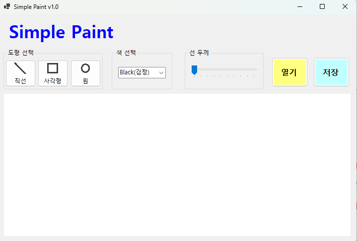
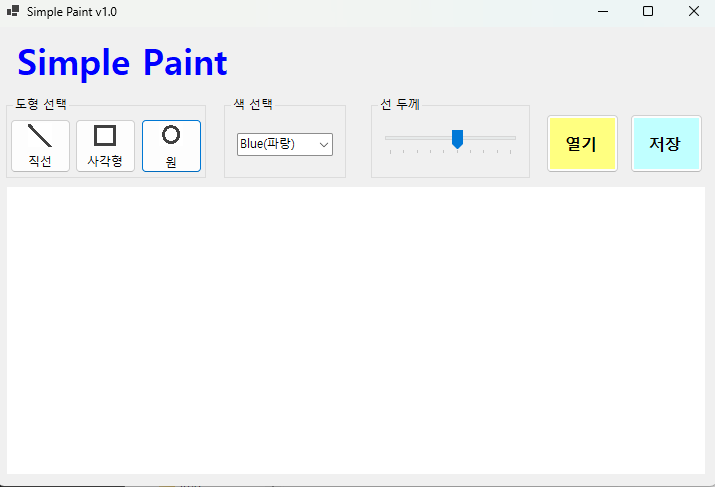
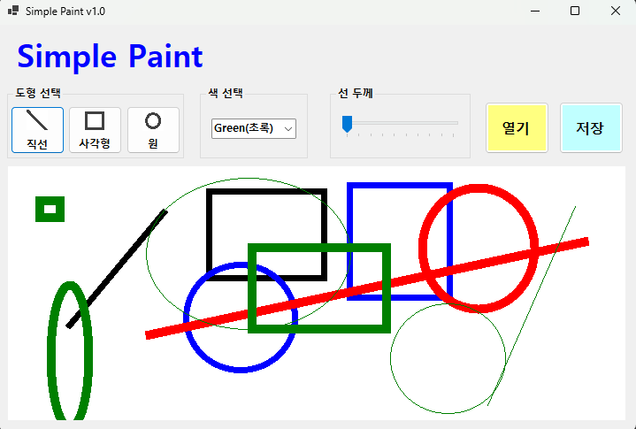
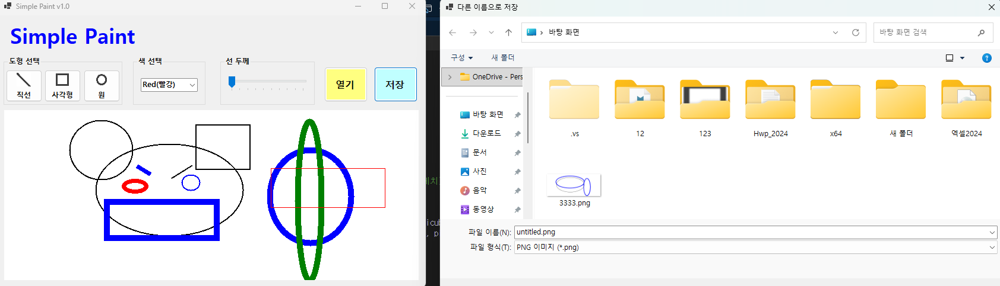
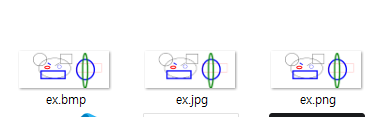
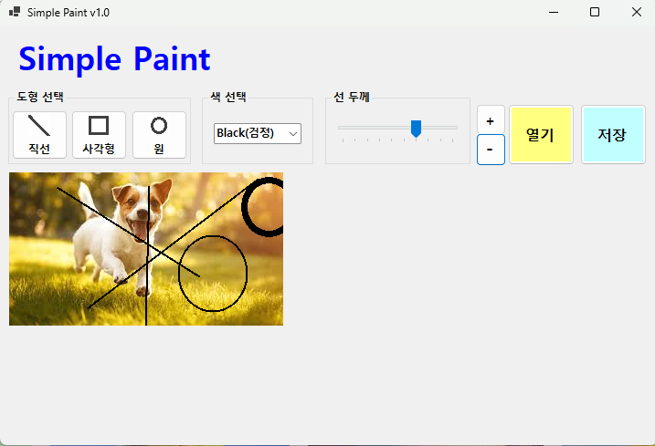
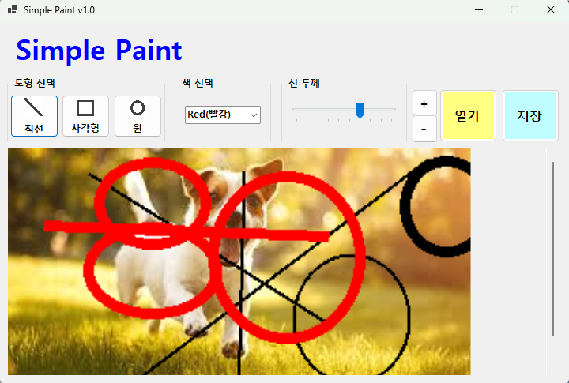
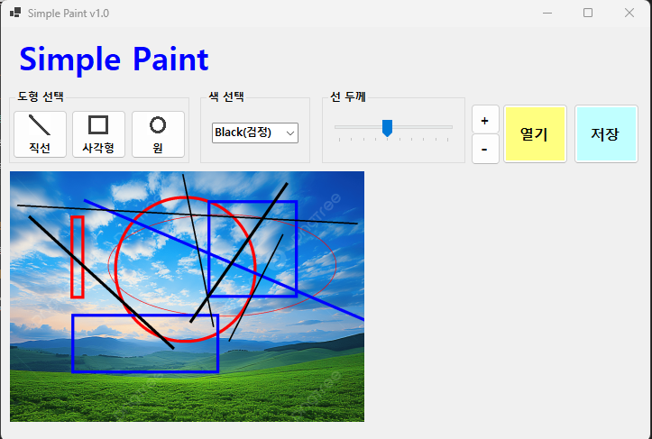

# # (C# 코딩 9주차) 그림판 (Simple Paint) 구현
***-- 22017004 컴퓨터 SW 강희준 --***

## 📑 개요: C# 프로그래밍 학습
- GDI+ 기술을 활용하여 선, 사각형, 원을 그릴 수 있는 그래픽 사용자 인터페이스(GUI) 애플리케이션 구현

### 사용한 플랫폼
- **Language & Framework:** C#, .NET Windows Forms
- **IDE:** Visual Studio 2022
- **Version Control:** GitHub

###  사용한 컨트롤
- **캔버스:** PictureBox (그림이 그려지는 실제 공간)
- **도구 선택:** Button (직선, 사각형, 원 도구 선택)
- **설정 제어:** ComboBox (색상 선택), TrackBar (선 두께 조절)
- **파일 제어:** Button (열기, 저장)
- **다이얼로그:** OpenFileDialog, SaveFileDialog (이미지 파일 입출력)

###  사용한 기술 및 개념 
- **GDI+ (Graphics Device Interface):** `Graphics` 객체와 `Pen` 클래스를 활용하여 도형 렌더링 기능 사용.
- **더블 버퍼링 및 비트맵 활용:** `Bitmap` 객체를 메모리 캔버스로 사용하고 `PictureBox`에 연결하여 화면 깜빡임 방지 및 이미지 보존.
- **마우스 이벤트 핸들링:** `MouseDown`, `MouseMove`, `MouseUp` 이벤트를 조합하여 드래그 앤 드롭 방식의 그리기 로직 구현.
- **실시간 미리보기:** `Paint` 이벤트와 `Invalidate()`를 활용하여 도형이 확정되기 전 점선 형태의 가이드라인 표시.

---

## 📸 과제 1: 기본 UI 배치 및 설정 기능 구현

 - 전체 UI 레이아웃과 도구 설정 인터페이스

 - 도구 선택과 색상, 선 굵기 설정 인터페이스

**✅ 과제 내용**
- 그림판의 기본 레이아웃 구성 및 배경색 설정
- 도형 선택, 색상 선택(`ComboBox`), 선 굵기(`TrackBar`) 등 기본적인 인터페이스 구현

**💡 상세 구현 내용**
- **인터페이스 구성:** `groupShape`, `groupColor`, `groupLineSize`로 그룹박스를 통한 도구 그룹화 진행함. 
- **속성 동기화:** `trbLineWidth_ValueChanged` 를 통해 선의 두께를 실시간으로 변수에 반영하고, `cmbColor`에서 선택한 항목을 `currentColor`에 즉시 할당하도록 구현.

**🔬 분석 및 학습 포인트**
- 컨트롤의 상태 값을 내부 변수(`currentShape`, `currentColor`, `currentLineWidth`)와 연동하여, 사용자 컨트롤에 따른 실시간 속성 변경이 가능하도록 하는 이벤트 기반 프로그래밍에 대해 학습함.

---

## 📸 과제 2: 마우스 드래그를 이용한 그림 그리기

**✅ 과제 내용**
- 마우스 드래그를 통한 실시간 도형 그리기 로직 구현
- 확정 전 도형을 점선으로 표시하는 미리보기 기능

**💡 상세 구현 내용**
- **드래그 로직:** `MouseDown` 시 시작점을 저장하고, `MouseMove`에서 끝점을 갱신하며 화면을 갱신함. `MouseUp` 시점에 최종 도형을 비트맵에 그려 확정.

- **미리보기와 확정:** `Paint` 이벤트에서는 점선(`DashStyle.Dash`) 펜으로 임시 도형을 그리고, `MouseUp` 시점에 비트맵(`canvasBitmap`)에 실선으로 도형을 영구적으로 그려놓도록 구현.

**🔬 분석 및 학습 포인트**
- 모든 움직임을 비트맵에 직접 그리면 잔상이 남기 때문에, '메모리 비트맵(확정)'과 'OnPaint(미리보기)'를 구분해야한다는 점을 배움.

- 또한 마우스 이벤트의 흐름과 `Invalidate()`를 활용한 화면 갱신 타이밍을 이해하는 데 큰 도움이 되었습니다.

---

## 📸 과제 3: 이미지 파일 저장 기능 구현

### bmp, jpg, png 등 다양한 이미지 포맷으로 저장하는 기능 구현 화면
**✅ 과제 내용**
- `SaveFileDialog`를 활용하여 작성한 그림을 이미지 파일로 저장

- 선택한 파일 확장자에 따라 적절한 이미지 포맷으로 저장

- 다양한 이미지 포맷(PNG, JPG, BMP) 지원

**💡 상세 구현 내용**
- `btnSaveFile_Click` 발생 시 `SaveFileDialog`를 통해 파일 경로를 입력받습니다.

- saveFileDialog에서 선택한 파일 확장자에 따라 `ImageFormat`을 결정하는 로직을 구현하였습니다. 예를 들어, `.png` 확장자를 선택하면 `ImageFormat.Png`로 저장하도록 처리하였습니다.

- `canvasBitmap.Save()` 메서드를 호출하여 메모리에 저장된 비트맵 데이터를 물리적 파일로 저장합니다. 선택한 확장자에 따라 `ImageFormat`이 자동으로 결정되도록 처리하였습니다.

**🔬 분석 및 학습 포인트**
- 이미지 파일 저장시 확장자에 따른 `ImageFormat` 매핑 로직을 구현하는 과정에서, 다양한 이미지 포맷의 특성과 저장 방식에 대해 학습하였습니다.

---

## 📸 과제 4: 외부 이미지 불러오기 및 편집

- 그림판 위에 외부 이미지를 불러와 편집하는 기능 구현 화면

- 확대 축소 기능 구현

- 큰 이미지도 원활하게 편집할 수 있도록 캔버스 크기 조절 기능 구현 화면

**✅ 과제 내용**
- `OpenFileDialog`를 통해 외부 이미지를 캔버스로 로드
- 로드된 이미지 위에 새로운 도형을 덧그려 편집하는 기능
- 확대 축소 기능과 캔버스 크기 조절 기능을 통해 다양한 크기의 이미지를 원활하게 편집할 수 있도록 구현
- 스크롤바를 활용하여 큰 이미지도 편집할 수 있도록 구현

**💡 상세 구현 내용**
- **이미지 로드:** `Image.FromFile()`로 이미지를 불러온 후, `canvasGraphics.DrawImage`를 사용하여 현재 캔버스 비트맵 위에 이미지를 그립니다.
 
- **연속 편집:** 불러온 이미지 위에 다시 `Graphics` 객체를 생성하여, 기존 이미지와 새로 그릴 도형이 자연스럽게 병합되도록 구현하였습니다.
 
- **확대 축소 및 캔버스 조절:** `TrackBar`를 활용하여 확대 축소 비율을 조절하고, `PictureBox`의 크기를 동적으로 변경하여 큰 이미지도 편집할 수 있도록 구현하였습니다. 또한, `AutoScroll` 속성을 활용하여 스크롤바가 자동으로 나타나도록 설정하였습니다.

**🔬 분석 및 학습 포인트**
- 외부 파일 스트림을 읽어와 메모리 내 그래픽 컨텍스트와 병합하여 편집 가능한 상태로 유지하는 리소스 관리 기법을 익혔습니다.

## 📌 결론
- 이번 과제를 통해 C#과 GDI+를 활용한 그래픽 애플리케이션 개발에 대한 실무적인 경험을 쌓을 수 있었습니다.
- 특히, 마우스 이벤트를 활용한 인터랙티브한 도형 그리기 로직과 이미지 파일 입출력 기능 구현을 통해 GUI 프로그래밍의 핵심 개념들을 깊이 있게 이해할 수 있었습니다.